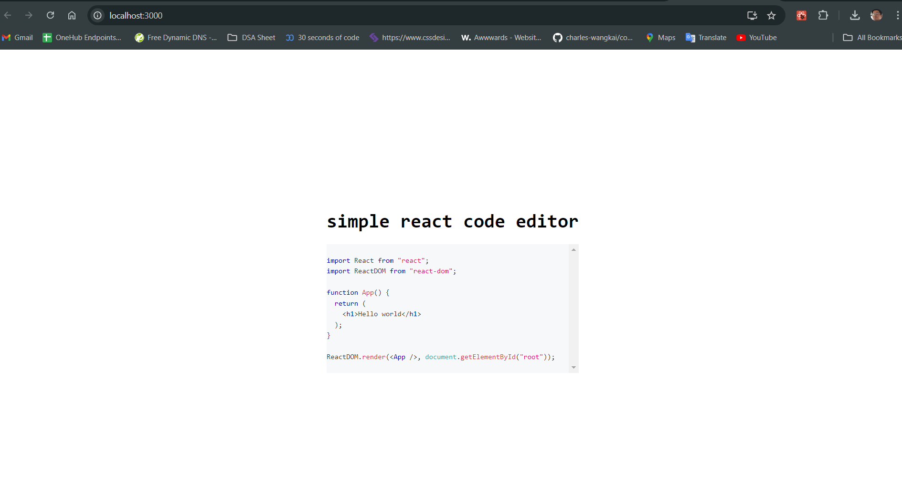

# Simple React Code Editor

Deployed URL - 

## Project Objective

Develop a simple web-based code editor using React, with syntax highlighting capabilities provided by PrismJS.

## Features

- **Text Input**: Users can input and edit code in a textarea element.
- **Syntax Highlighting**: The inputted code will be automatically highlighted using PrismJS.
- **Language Support**: Initial support for JavaScript with potential to extend to other languages.

## Technology Stack

- **Frontend Framework**: React
- **Syntax Highlighting**: PrismJS and prism-react-renderer
- **Styling**: CSS

## Key Components

- **CodeEditor Component**: 
  - Handles user input via a textarea.
  - Displays syntax-highlighted code using PrismJS.

## Screenshots:



## Local Installation

1. Clone the repository:

   ```bash
   git clone 
2. Navigate to the project's directory:

   ```bash
   cd assignment
3. Install dependencies:
   ```bash
   npm install
4. To run the project locally:
   ```bash
   npm run dev
   
---